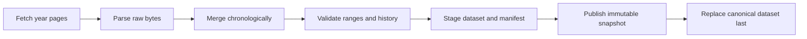

# 資料管線與操作方式

本文件說明 Lottery ML Portfolio 如何從公開歷史頁面建立可追溯的 canonical dataset。技術名稱保留英文，解釋使用繁體中文。

## 資料來源

- 年份索引：`https://www.nfd.com.tw/lottery/lottyear/year.htm`
- 年度頁面：`https://www.nfd.com.tw/lottery/power-38/{year}.htm`
- 目前 backfill 起始年：2008

NFD 頁面使用 Big5 編碼，表格欄位為「年份、日期、期數、球號 1–6、特號、總期數」。Parser 依 header name 建立欄位 mapping，不依賴脆弱的固定 table index。測試 fixtures 只保存少數真實列值與必要 HTML 結構，並保留 source URL 與 retrieval date。

## Pipeline flow



每次 ingestion 會先抓完並解析所有指定年份，之後才開始任何 write。只要其中一頁 fetch 或 parse 失敗，現有 canonical dataset、snapshot、manifest 都不會改變。

## Validation gates

1. 第一區必須正好六個不同整數，範圍 1–38。
2. 第二區必須是 1–8。
3. Draw date 必須 strictly increasing，draw ID 不得重複。
4. 既有 draw 不得消失。
5. 既有 draw 的值不得改變，除非 correction registry 精確匹配 old 與 new record。
6. Correction registry 不允許未使用的 exception，避免例外規則永久累積。
7. Proposed dataset 不得為空。
8. Snapshot／manifest path 不得覆寫既有內容。

## Correction registries

來源資料與 canonical history 使用兩個不同 registry，避免把不同風險混在一起。

### Source corrections

位置：`configs/data/source-corrections.json`

已核對的來源 typo 必須用 draw ID、field、old value、new value 做 exact match，不能在 parser 裡寫死日期判斷。Correction 還必須記錄 reason 與獨立 sources。若來源值不再匹配，correction 會變成 unused，整次 ingestion 失敗並要求人工重新審查。

目前 registry 記錄 NFD `2025-10-09` 把第二區誤寫成不可能的 `28`；[TVBS](https://news.tvbs.com.tw/life/3011821) 與[中央社／經濟日報](https://money.udn.com/money/story/122328/9060934)均記錄第二區為 `08`。套用的 correction ID 會寫入 manifest。

### Historical corrections

位置：`configs/data/corrections.json`

若來源真的改寫已經 publish 的歷史紀錄，先用可信來源人工核對，再新增一筆包含下列內容的 correction：

- `draw_id`
- 完整 `old` record
- 完整 `new` record
- `reason`
- 可追查的 `source`

Historical correction 只允許精確匹配一次。成功 publication 後，manifest 的 `corrections_applied` 會留下記錄；entry 應在下一次正常 ingestion 前移除，Git history 仍保留審查軌跡。

## Immutable snapshot contract

```text
data/raw/snapshots/<YYYYMMDDTHHMMSS+0800>/power-lottery.json
data/manifests/<YYYYMMDDTHHMMSS+0800>.json
data/processed/power-lottery.json
```

Snapshot 是當次 verified dataset 的 immutable copy。Manifest 記錄：

- `schema_version`
- `fetched_at`
- `source_urls`
- canonical bytes 的 `sha256`
- `draw_count`
- `date_min`／`date_max`
- `validation_status`
- `corrections_applied`
- `git_commit`

所有檔案先寫入 transaction staging directory，再重新讀取驗證。Publication 順序是 snapshot、manifest、canonical；canonical 一定最後 atomically replace。Canonical 前發生錯誤時，本次建立的 snapshot 與 manifest 會 rollback。

## Local commands

Initial backfill：

```powershell
lottery-ml ingest --from-year 2008 --through-year 2026 --root .
```

正式 scheduled ingestion 也會重新讀取完整 configured range，才能證明歷史紀錄沒有被刪除或改寫。

成功輸出是一行 JSON：

```json
{"manifest_path":"...","sha256":"...","snapshot_path":"...","status":"published"}
```

資料內容相同時 `status` 是 `unchanged`，兩個 path 為 `null`。

## Failure behavior

- HTTP timeout／status failure：不寫檔，stderr 只顯示安全摘要。
- HTML schema drift：parser fail closed，不猜測新欄位位置。
- Historical mutation：除非 correction 精確匹配，否則拒絕 publication。
- Write／atomic replace failure：保留上一版 canonical bytes。

## Automation boundary

GitHub Actions 會在 Phase 7 加入：台灣時間每週一、週四 21:15 scheduled ingestion，以及 repository owner 可用的 `workflow_dispatch`。同一套 CLI 同時供本機與 CI 使用，不建立第二條 ingestion implementation。
