# Lottery ML Portfolio 系統設計

- 日期：2026-07-15
- 狀態：已核准，等待 implementation plan
- Repository：`newesp/Lottery-ML-Portfolio`
- 本機路徑：`E:\Leo\Projects\Lottery-ML-Portfolio`
- 主要受眾：技術主管與 ML 招募者

## 1. 目標與非目標

### 1.1 產品目標

使用台灣威力彩歷史資料，建立一個繁體中文優先、具 RWD、專業美觀的 ML 作品集網站。專案需展示：

1. 歷史資料取得、驗證、標準化與版本管理。
2. Leakage-safe feature engineering。
3. 模型選擇、模型專屬 preprocessing 與有限度超參數搜尋。
4. Expanding-window Time Series Cross Validation。
5. Locked temporal holdout、baseline comparison 與不確定性評估。
6. 可重現的 experiment artifacts 與預先計算的 Experiment Playground。
7. 對「模型沒有穩定優於隨機」的誠實解讀。
8. 讓 ML 新手可以循序理解並繼續研究的文件系統。

### 1.2 非目標

- 不宣稱能可靠預測威力彩。
- 不提供投注建議、即時下注或財務決策功能。
- v1 不在 Web runtime 重新訓練模型。
- v1 不提供公開的 `Fetch latest` 按鈕。
- v1 不使用 GSAP、scroll hijacking、複雜 pinned sections 或裝飾性無限動畫。
- v1 不建立資料庫、工作佇列或常駐 Python API。
- v1 不加入 ensemble；ensemble 保留為未來研究擴充。
- Monte Carlo、Expected Value 與 Kelly Criterion 不混入 predictive model benchmark。

## 2. 來源專案整併原則

新 repository 是唯一 canonical implementation。既有專案只作為來源：

### 2.1 Lottery-Codex 提供

- `src/` package layout。
- CLI、資料驗證、feature pipeline。
- Logistic Regression pipeline。
- Expanding-window evaluation 的工程基礎。
- Run tracking、package versions、git metadata。
- pytest 與 Ruff 設定。

### 2.2 Lottery-Claude 提供

- Uniform、historical frequency 與 shuffle baselines。
- Random Forest、LightGBM 與 multi-seed evaluation。
- Chi-square、Bayesian Dirichlet-Multinomial 與 bootstrap 分析。
- Monte Carlo、人類選號偏誤、Expected Value 與 Kelly Criterion 研究素材。

### 2.3 不直接搬移的內容

- 重複的大型頂層 scripts。
- 沒有測試或資料契約的輸出流程。
- Claude 版 inverse-logloss ensemble。
- Codex 版依 row order 配對 probability 與 target 的評估方式。
- 既有 `.venv`、cache、backup、generated reports 與無法驗證的環境狀態。

所有移植邏輯必須改為可測試模組，並使用新的 artifact schema。

## 3. 系統架構

```mermaid
flowchart LR
    A["NFD 威力彩年度頁面"] --> B["Fetch"]
    B --> C["Immutable raw snapshot"]
    C --> D["Parse and validate"]
    D --> E["Canonical dataset"]
    E --> F["Leakage-safe features"]
    F --> G["Time Series CV and tuning"]
    G --> H["Locked holdout evaluation"]
    H --> I["Versioned experiment artifacts"]
    I --> J["Next.js static build"]
    J --> K["GitHub Pages"]
```



### 3.1 Planned repository layout

```text
Lottery-ML-Portfolio/
├─ README.md
├─ pyproject.toml
├─ src/lottery_ml/
│  ├─ data/
│  ├─ features/
│  ├─ models/
│  ├─ evaluation/
│  ├─ experiments/
│  └─ cli.py
├─ research/
│  ├─ statistical_validation/
│  └─ decision_analysis/
├─ configs/
│  ├─ features/
│  └─ experiments/
├─ data/
│  ├─ raw/snapshots/
│  ├─ processed/
│  └─ manifests/
├─ artifacts/
│  ├─ experiments/
│  ├─ summaries/
│  └─ schemas/
├─ tests/
│  ├─ fixtures/
│  ├─ data/
│  ├─ features/
│  ├─ evaluation/
│  └─ artifacts/
├─ web/
│  ├─ app/
│  ├─ components/
│  ├─ content/zh-TW/
│  ├─ locales/
│  └─ public/artifacts/
├─ docs/
└─ .github/workflows/
```

Python 與 Web 透過 versioned JSON/CSV artifacts 溝通，不互相 import implementation code。

## 4. Data ingestion 與版本管理

### 4.1 Source

- 入口：`https://www.nfd.com.tw/lottery/lottyear/year.htm`
- 威力彩年度頁：`https://www.nfd.com.tw/lottery/power-38/{year}.htm`
- 初始資料範圍：2008 年至目前年度。

Parser 讀取年份、日期、期數、第一區六個號碼、第二區號碼及總期數。來源不是官方 API，因此網站及文件必須標示來源和限制。

### 4.2 Schedule

GitHub Actions 於 `Asia/Taipei` 每週一、週四 21:15 執行，並提供 repository owner 使用的 `workflow_dispatch`。選擇 21:15 是為了讓來源網站在 20:30 開獎後有更新緩衝，並避開整點排程高峰。

排程只負責呼叫同一個可在本機執行的 CLI，不另建一套 ingestion 邏輯。

### 4.3 Snapshot contract

只有內容 hash 改變且通過全部驗證時，才建立新 snapshot：

```text
data/raw/snapshots/<YYYYMMDDTHHMMSS+0800>/power-lottery.json
data/manifests/<YYYYMMDDTHHMMSS+0800>.json
data/processed/power-lottery.json
```

Manifest 必須包含：

- `schema_version`
- `fetched_at`
- `source_urls`
- `sha256`
- `draw_count`
- `date_min`、`date_max`
- `validation_status`
- `corrections_applied`
- `git_commit`

### 4.4 Validation gates

- 第一區恰有六個不重複整數，範圍 1–38。
- 第二區為整數，範圍 1–8。
- 日期可解析且不得晚於抓取時間。
- 期數與日期不得重複。
- 新資料不得刪除或改寫既有歷史紀錄；已核准 correction 除外。
- 最新 snapshot 的 draw count 不得低於上一版。
- HTML 欄位數或 table 結構改變時阻擋 publish。

已知來源異常集中記錄在 versioned correction registry，包含原始值、修正值、理由與測試，不在 parser 內隱藏修改。

抓取或驗證失敗時保留上一份 verified dataset，CI 失敗並留下 report。

排程取得新 draw 後，只以已凍結的 v1 model/protocol 更新 holdout predictions、summary artifacts 與 static Web build，不重新調參。完整 experiment matrix 只在人工核准新的 protocol version 時重新產生。

## 5. 問題定義與資料形狀

第一區和第二區分開建立模型：

- 第一區：每期展開 38 個 candidate rows，target 表示號碼是否出現在該期六個號碼中；推論時選 Top 6。
- 第二區：每期展開 8 個 candidate rows，target 表示號碼是否為第二區號碼；推論時選 Top 1。

同一期 candidate rows 共享 `draw_id`。任何 split、bootstrap 或 metric aggregation 都以 draw 為基本單位，不得拆散同一期資料。

所有特徵在第 `t` 期只能使用 `< t` 的歷史資料。Feature builder 不接受包含未來 target 的聚合輸入。

## 6. Feature sets

實驗使用四個 versioned feature sets：

1. `frequency`：rolling frequencies、lifetime count/rate。
2. `frequency_gap`：frequency 加 gap、average gap、gap ratio、hot/warm/cold indicators。
3. `temporal_context`：日期、前一期、co-occurrence、draw shape。
4. `full`：所有通過 leakage review 的 v1 特徵；目前預期約 74 欄，實際欄位由 versioned config 與 artifact 記錄。

Feature ablation 是主要展示內容。Web 不只比較模型，也比較新增特徵是否跨時間穩定改善 baseline。

## 7. Models 與 preprocessing

### 7.1 Baselines

- Uniform Random：理論基準。
- Rolling Frequency：只使用當期以前的 rolling rate 排名。
- Shuffled History：sanity check，用來偵測 leakage 或錯誤驗證。

### 7.2 Trainable models

- Logistic Regression。
- Random Forest。
- LightGBM。

模型演進故事為 linear baseline → bagging trees → gradient boosting。v1 不為增加數量而加入更多模型。

### 7.3 Model-specific preprocessing

- Logistic Regression 使用 `StandardScaler`，scaler 只在每個 fold 的 train partition fit。
- Random Forest 與 LightGBM 不做數值標準化。
- Logistic Regression 預設 `class_weight=None`，以保留 probability calibration；`balanced` 僅作 ablation。
- Preprocessor 與 estimator 必須包在同一個 sklearn-compatible pipeline。

### 7.4 Bounded hyperparameter search

- Logistic Regression：L2 penalty，最多四個 `C` candidates。
- Random Forest：固定合理的 tree count，最多六組 `max_depth`、`min_samples_leaf`、`max_features` 組合。
- LightGBM：最多六組 `num_leaves`、`learning_rate`、`min_child_samples` 組合，使用 early stopping。
- Random Forest 與 LightGBM 使用 seeds `17`、`42`、`2026`。
- 搜尋空間放在 versioned config，不藏在 Python source。

選擇規則使用 development CV mean primary metric，並檢查 fold stability、probability metrics 與模型複雜度。最終 holdout 不參與任何選擇。

## 8. Time Series Cross Validation

### 8.1 Development folds

使用 expanding-window、完整年度 validation：

| Fold | Train | Validation |
|---|---|---|
| 1 | 2008–2017 | 2018 |
| 2 | 2008–2018 | 2019 |
| 3 | 2008–2019 | 2020 |
| 4 | 2008–2020 | 2021 |
| 5 | 2008–2021 | 2022 |
| 6 | 2008–2022 | 2023 |

### 8.2 Locked holdout

2024-01-01 起為 locked temporal holdout。它不參與 feature selection、hyperparameter tuning、seed selection 或 model selection。當資料持續更新時，holdout end date 隨 verified dataset 前進，但 start date 固定。

首次 unblind holdout 前，v1 feature、model、hyperparameter 與 selection rule 必須凍結。日後若根據 holdout 結果修改方法，必須建立新的 protocol version，並明確標示舊 holdout 已被觀察；不得繼續把修改後結果稱為原始 locked-holdout evaluation。

### 8.3 Split implementation

不得直接對 candidate-row DataFrame 使用一般 row-based split。`ExpandingWindowSplitter` 必須先依 `draw_id` 和日期切分，再展開或映射回 candidate rows，並驗證：

- train max date < validation min date。
- train 與 validation draw IDs 不相交。
- holdout draw IDs 不出現在任何 CV fold。
- 同一 draw 的所有 candidates 位於同一 partition。

## 9. Evaluation

### 9.1 Primary ranking metrics

第一區：

- Average hits per draw。
- Precision@6 / Recall@6。
- Lift over Uniform。

Uniform 理論平均命中數為 `6 × 6 / 38 = 0.9474`。

第二區：

- Top-1 accuracy。
- Lift over 12.5% Uniform baseline。

### 9.2 Probability and stability metrics

- Brier score。
- Log loss。
- Calibration summary/plot。
- Fold mean、standard deviation 與 per-fold values。
- Stochastic model 的 seed mean、standard deviation。
- Training time 與 inference time。

Probability 與 target 必須以 `(draw_id, area, number)` key 明確 join 後計算，不依賴 DataFrame row order。

### 9.3 Uncertainty

Final holdout 使用 draw-level paired bootstrap 比較 model 和 baseline。v1 固定使用 10,000 次 resamples 與 seed `2026`，輸出 effect estimate、confidence interval、resample count 與 seed。文件需說明此方法把各 draw 視為可交換觀測值，以及這項假設的限制。

### 9.4 Reporting contract

網站同時顯示 CV 與 holdout，但不混合平均：

- CV 用於 development comparison。
- Holdout 用於最終 temporal generalization check。
- 不以單一最好 fold 或單一最好 metric 宣稱成功。
- 結論必須說明模型是否跨 folds、seeds 與 holdout 穩定優於 Uniform。

## 10. Research extensions

### 10.1 Statistical validation

- Chi-square randomness checks。
- Bayesian Dirichlet-Multinomial posterior analysis。
- Multi-seed stability。
- Bootstrap difference tests。

### 10.2 Decision analysis

- Human-number-selection bias simulations。
- Monte Carlo payout sharing。
- Expected Value sensitivity。
- Kelly Criterion risk illustration。

Decision analysis 必須與 predictive benchmark 分頁呈現，並清楚標示依賴的票量、獎金、稅率與共得者行為假設。它不構成投注建議。

## 11. Experiment artifacts

每個 run 具有不可變 `run_id` 與獨立目錄，至少包含：

- `run-config.json`
- `fold-results.csv`
- `holdout-results.csv`
- `predictions.parquet` 或等價的 typed artifact
- `summary.json`
- `environment.json`

Run config 必須記錄 data hash、feature version/columns、model parameters、seed、split boundaries、package versions、git commit 與 dirty state。

只有 fold 完整、schema valid 的成功 run 才能進入 Web summary。部分成功的 folds 不得計算並發布平均值。

Web build 從成功 artifacts 產生 versioned、只讀 JSON。頁面不得手動寫死模型分數。

## 12. Web product design

### 12.1 Experience

網站採「Case Study + 預先計算 Experiment Playground」：

- Case Study 讓技術主管在 3–5 分鐘理解問題、流程、評估與負面結論。
- Playground 讓訪客切換 area、model、feature set、fold 與 seed summary，立即載入真實 artifacts。
- UI 使用 `Load`、`Compare` 或 `View run`，不假裝正在即時訓練。

### 12.2 Routes

```text
/                   Case Study
/data               資料來源、驗證與標準化
/features           Feature Explorer
/experiments        Experiment Playground
/evaluation         CV、holdout、baseline、統計檢定
/findings           Negative result 與 lessons learned
/reproducibility    Hash、run config、環境與重現方式
```

### 12.3 Frontend architecture

- Next.js App Router。
- TypeScript。
- Static export；v1 不需要 runtime server。
- CSS variables 與 utility-based styling；Taste Skill 只作 Case Study/敘事頁設計審核，不作 runtime dependency。
- 資料圖表使用 Apache ECharts，並提供 responsive resize、tooltip 與 keyboard-accessible fallback table。
- v1 不使用 GSAP；只使用 CSS transitions 與 chart library 的必要狀態轉換。

### 12.4 RWD requirements

最低驗證 viewport：375、768、1024、1440 px。

- 多欄 section 在 `<768px` 明確轉為單欄，不依賴偶然換行。
- Playground control bar 在 mobile 轉為可展開 filter panel。
- 圖表優先 responsive redraw；無法合理縮放的表格使用有標示的水平捲動。
- Touch targets 至少 44×44 CSS pixels。
- Navigation desktop 單行，mobile 使用標準 menu。
- 不使用固定高度 `100vh` 造成 mobile browser chrome 跳動。

### 12.5 Visual direction

- ML-first、專業、乾淨的 developer portfolio。
- 避免 AI-purple glow、過量 glassmorphism、三張相同 feature cards 與裝飾性 fake dashboard。
- 視覺素材以真實圖表、資料 lineage、validation report 與實際 product UI 為主。
- Motion 只用來表達 hierarchy、feedback 或 state transition。

## 13. Language and documentation

### 13.1 v1 language

- Web 與教學文件使用繁體中文。
- ML 技術名詞保留英文，方便搜尋。
- 程式碼、artifact keys 與 identifiers 使用英文。
- UI copy 集中於 `web/locales/zh-TW.json`；長內容位於 `web/content/zh-TW/`。

### 13.2 English version

v2 增加正式人工校閱的 English content 與 locale routes。語言切換需保留目前 route 和 Playground query state。所有 chart labels、tooltips、errors、metadata 與 accessibility labels 都必須翻譯。

Google/browser full-page translation 只作訪客的臨時輔助，不是正式英文版，也不作為 production dependency。

### 13.3 Documentation system

`docs/system-design.md` 在實作階段由本規格整理為長期架構入口；主題文件依 `docs/README.md` 的導覽建立。

每篇 ML 教學文件固定包含：

1. 這是什麼。
2. 為什麼本專案需要它。
3. 直覺例子。
4. 必要數學定義。
5. 本專案實作。
6. 常見錯誤與 leakage。
7. 如何解讀輸出。
8. 對應程式碼。
9. 可繼續搜尋的英文關鍵字。
10. 官方或可靠參考資料。

ADR 記錄被採用的方案、替代方案、理由、限制及重新檢討條件。

## 14. Error handling

### 14.1 Pipeline

- Fetch failure：不建立 snapshot，保留上一份 verified data。
- Parse/schema failure：阻擋 processed data 與 Web artifact 更新。
- Experiment fold failure：整個 run 標示 failed，不發布 partial aggregate。
- Artifact schema mismatch：Web build 失敗，上一個成功部署保持可用。

### 14.2 Web

- Missing artifact：顯示可理解的 unavailable state，不渲染假零值。
- Empty selection：解釋目前 filter 沒有相符 run。
- Unsupported schema：顯示資料版本不相容並提供 reproducibility link。
- 所有 loading、empty、error、success states 都有對應 UI 與 accessible text。

## 15. Testing and quality gates

### 15.1 Python

- Parser fixtures covering multiple years and source anomalies。
- Data range、duplicate、historical mutation tests。
- Feature leakage tests。
- Split chronology、draw grouping、holdout isolation tests。
- Preprocessor fit-boundary tests。
- Probability-target key alignment tests。
- Uniform theoretical baseline tests。
- Metric unit tests。
- Fixed-seed smoke reproducibility。
- Artifact schema validation。
- Ruff、type checks、pytest。

### 15.2 Web

- Component tests for main routes and Playground filters。
- Loading、empty、error state tests。
- Keyboard navigation、focus visibility、semantic table fallback。
- RWD visual checks at 375、768、1024、1440 px。
- Static production build。
- Accessibility audit and Lighthouse review。

### 15.3 CI gates

- Pull requests：Python lint/type/test、Web lint/type/test/build、artifact schema checks。
- Scheduled ingestion：fetch → validate → snapshot/publish only on verified change。
- Deployment：只部署成功的 static build；失敗時保留上一版。

## 16. Security and external effects

- Web 不接受使用者輸入來觸發 scraping 或 training。
- Scraper 設定明確 timeout、固定 User-Agent 與低頻率 requests，不繞過來源網站限制。
- CI 不將 secrets、private environment values 或完整 HTTP error bodies寫入公開 artifacts。
- Scheduled workflow 的 repository write 權限限制在必要範圍。

## 17. v1 delivery scope

v1 完成條件：

1. 可重現地抓取並驗證歷史資料，成功建立 manifest 與 canonical dataset。
2. 四組 feature sets 通過 leakage tests。
3. 三個 baselines 與三個 trainable models 完成六個 expanding-window folds。
4. 2024 起 locked holdout 完成，CV 與 holdout 分開報告。
5. Experiment artifacts 通過 schema validation。
6. Case Study 與 Playground 可由 static artifacts 正確呈現。
7. Web 通過指定 viewport、build、accessibility 與核心互動測試。
8. README、learning path、glossary、核心 ML 文件與 ADR 完成。
9. GitHub Actions 支援週一／週四排程與 owner manual trigger。
10. GitHub Pages 成功部署指定 commit，公開頁面完成 smoke test。

## 18. Deferred work

- 正式英文版與中英切換。
- Ensemble 或 learning-to-rank models。
- 即時 Web training。
- 公開 Web fetch control。
- GSAP 或複雜 motion。
- Production database、job queue 或 model registry service。
- 更大規模的 hyperparameter optimization。

## 19. Success criteria

技術主管應能在 3–5 分鐘內回答：

- 資料從哪裡來、如何驗證。
- 如何避免 temporal leakage。
- 為何選擇這些 models、features 與 metrics。
- CV 與 holdout 如何分工。
- 模型是否真的穩定優於 Uniform。
- 如何重現任何 Web 上顯示的結果。

專案作者應能透過文件理解每個主要 ML 決策，找到對應程式碼與 artifacts，並取得可繼續查詢的英文關鍵字。
